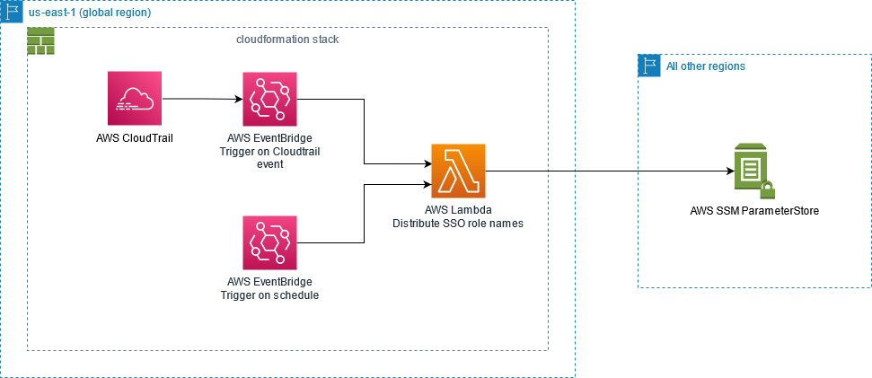

*************************
AWS SSO role names mapper
*************************

Description
===========
The Problem
-----------
Generated IAM roles by SSO, have long and hard to remember names like:
"*AWSReservedSSO_DatabaseAdministrator_e90c045f34e6a0ad*"

The Solution
------------
| This project maps IAM role names created by SSO to simple names in AWS Parameter store.
|
| IAM Role Name: "*AWSReservedSSO_DatabaseAdministrator_e90c045f34e6a0ad*"
| Name stored in Parameter Store: "*DatabaseAdministrator*"

Prerequisites
=============

- `AWS CLI <https://docs.aws.amazon.com/cli/latest/userguide/cli-chap-install.html>`_ (If you are using AWS SSO you need AWS CLI version 2)
- Configured `AWS CLI credentials <https://docs.aws.amazon.com/cli/latest/userguide/cli-configure-files.html>`_
- `Java JDK 11 <https://www.oracle.com/se/java/technologies/javase-jdk11-downloads.html>`_ (or later)
- Configured GraalVM, see `this guide <https://quarkus.io/guides/building-native-image#configuring-graalvm>`_
- `Maven <https://maven.apache.org/install.html>`_
- `Docker <https://docs.docker.com/get-docker/>`_

Build
=====

To build make sure you have `Docker <https://docs.docker.com/get-docker/>`_ running.

1. Clone this repository into a folder of choice
2. Run :code:`mvn clean package -Pnative`

Deploy
======

Manual deploy
-----------------
1. Clone this repository into a folder of choice
2. Create a bucket to store zipped code (:code:`aws s3 mb s3://mybucket --region us-east-1`)
3. Configure deploy settings in pom.xml, see `Configuration`_
4. Run :code:`mvn deploy -Pnative`

Deploy from Attini's prebuilt SAM App
--------------------------------------

If you don't want to build the project your self, Attini provides a prebuilt SAM Application.

1. Navigate the CloudFormation console in the N. Virginia (us-east-1) region.
2. Create a new CloudFormation stack with using the template located at s3 url: :code:`https://attini-artifacts-us-east-1.s3.amazonaws.com/aws-sso-role-names-mapper/latest-template.yaml`.

How to test in AWS
==================

TriggerOnEvent
--------------
1. Navigate to the lambda created by the Cloudformation stack
2. Click on Test
3. Create a new test event for creating role using the payload located in **src/test/resources/createRolePayload.json**
4. Run the Test to create parameter for test-role (notice, no such role is created in IAM)
5. Make sure parameter was added by checking lambda response or Parameter Store
6. Create a new test event for deleting role using the payload located in **src/test/resources/deleteRolePayload.json**
7. Run the Test to delete parameter for test-role (again, no such role is deleted in IAM)
8. Make sure parameter was deleted by checking lambda response or Parameter Store

TriggerOnSchedule
-----------------
1. Navigate to the lambda created by the Cloudformation stack
2. Click on Test
3. Create a new test event using the payload located in **src/test/resources/scheduledPayload.json**
4. Run the Test

| If the test passed you can optionally set the TriggerOnSchedule event to trigger every minute and
| then make sure the lambda is triggered.

Configuration
=============
In **pom.xml**, under the :code:`<properties>` configure the following variables:

- :code:`<stackName>` Name of the Cloudformation stack
- :code:`<parameterStorePrefix>` Prefix for parameter names in Parameter store. Example: "/*your-organisation*/role-name-mappings/"
- :code:`<schedule>` Schedule for the event TriggerOnSchedule, see `AWS documentation <https://docs.aws.amazon.com/eventbridge/latest/userguide/eb-create-rule-schedule.html>`_
- :code:`<s3Bucket>` Bucket Name (don't include **s3://**). Example: "s3://**{s3Bucket}**/{s3BucketKey}"
- :code:`<s3BucketKey>` Bucket object key. Example: "s3://{s3Bucket}/**{s3BucketKey}**"

Cloudformation Stack
====================

